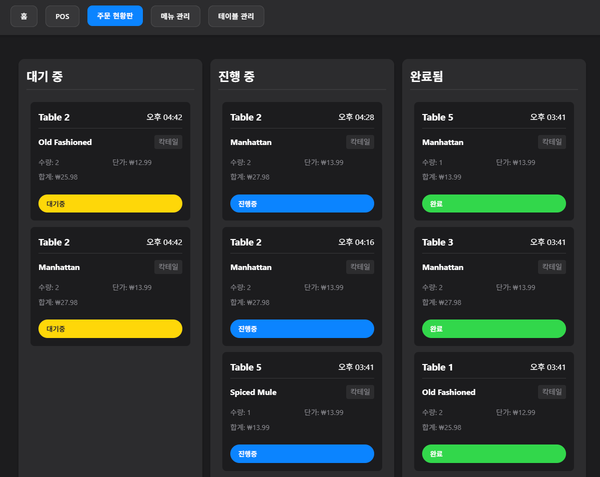

# Modern Kanban-type POS System for Tablet PC - v0.5

A modern, real-time Point of Sale (POS) system built with Flask and WebSocket, featuring a sleek dark-themed UI and intuitive order 



## 🌟 Features

### 💻 Core Features
- Real-time order management with WebSocket
- Drag & drop ticket management
- Modern dark-themed UI with glass-morphism design
- Responsive design for all devices
- Real-time sales statistics

### 🎯 Key Components
- **POS Interface**: Quick order entry and table management
- **Order Board**: Real-time ticket management with drag & drop
- **Menu Management**: Easy menu and category management
- **Table Management**: Dynamic table setup and status tracking
- **Real-time Statistics**: Live sales and order tracking

## 🚀 Getting Started

### Prerequisites
- Python 3.8+
- MySQL 5.7+
- Node.js (for WebSocket support)

### Installation

1. Clone the repository

```bash
git clone [repository-url]
cd tablet_pos
```

2. Create and activate virtual environment

```bash
python -m venv venv
source venv/bin/activate  # On Windows: venv\Scripts\activate
```

3. Install dependencies

```bash
pip install -r requirements.txt
```

4. Set up the database

```bash
mysql -u root -p < database_setup.sql
```

5. Configure environment variables

```bash
cp .env.example .env
# Edit .env with your database credentials
```

6. Run the application

```bash
python app.py
```

The application will be available at `http://localhost:5000`

## 🔧 Configuration

### Environment Variables
- `DB_HOST`: Database host (default: localhost)
- `DB_USER`: Database user (default: pos_user)
- `DB_PASSWORD`: Database password
- `DB_NAME`: Database name (default: pos)

### Database Setup
The system uses MySQL with the following main tables:
- `tables`: Store table information
- `menus`: Store menu items
- `order_items`: Store order information

## 📱 Usage

### POS Interface
1. Select a table
2. Choose menu items
3. Add quantities and notes
4. Submit order

### Order Management
1. View orders in the ticket board
2. Drag & drop to update status
3. Long-press for additional options
4. View order details and history

### Menu Management
1. Add/edit menu items
2. Set prices and categories
3. Toggle item availability
4. Manage menu categories

### Table Management
1. Add/edit tables
2. Monitor table status
3. View active orders
4. Manage table layout

## 🛠 Technical Stack

### Backend
- Flask (Python web framework)
- Flask-SocketIO (WebSocket support)
- MySQL (Database)
- SQLAlchemy (ORM)

### Frontend
- Vanilla JavaScript
- WebSocket
- Modern CSS with Glass-morphism
- Responsive Design

### Features
- Real-time updates
- Drag & drop functionality
- Touch-friendly interface
- Modern animations
- Error handling
- Loading states

## 📝 API Documentation

### Main Endpoints
- `/api/orders`: Order management
- `/api/menus`: Menu management
- `/api/tables`: Table management
- `/api/stats`: Statistics and analytics

### WebSocket Events
- `order_status_updated`: Order status changes
- `new_orders`: New order notifications
- `table_updated`: Table status updates
